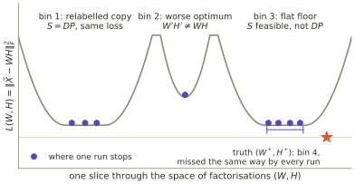
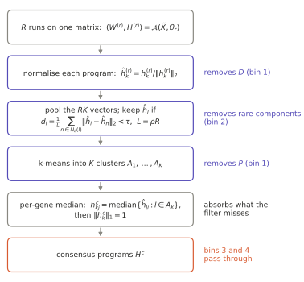
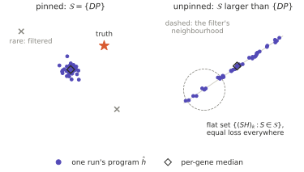
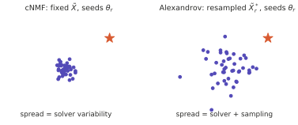
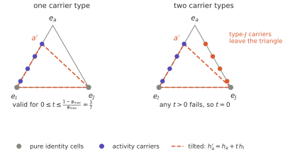
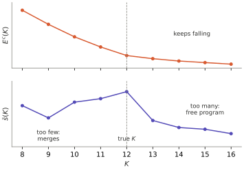
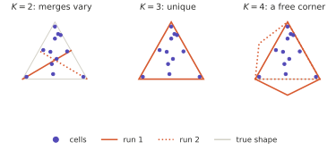
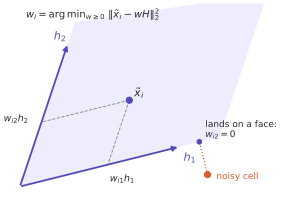
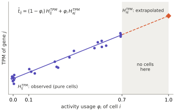

# cNMF: what the consensus estimates, how K is chosen, and what the refits mean

> **Written with an AI assistant.** Written by me with Claude from the study session of
> 2026-10-07, while reading Kotliar et al. 2019 (cNMF). It is *material*, not evidence of
> understanding: what I actually derived, and what was only given to me, is recorded in
> [topics/nmf.md](../../topics/nmf.md) and [practice/nmf.md](../../practice/nmf.md). Proofs are
> folded so they can be tried first.

**Builds on** [NMF: what the data pins down](nmf-identifiability-and-loss.md): §2 (every exact
factorisation is $(WS^{-1}, SH)$ for an invertible $S$) and §4 (pure cells and marker genes force
$S = DP$).

**The question.** cNMF runs NMF many times and reports a median. Which differences between runs
does that remove, what does the median estimate, how is $K$ chosen, and what do the final outputs
mean?

---

## 0 Notation

| Symbol | Meaning |
| --- | --- |
| $\tilde X \in \mathbb{R}^{N\times G}_{\ge 0}$ | counts of the $G = 2000$ most over-dispersed genes, each gene divided by its standard deviation |
| $W \in \mathbb{R}^{N\times K}_{\ge 0}$, rows $w_i$ | usages (the paper's $U$) |
| $H \in \mathbb{R}^{K\times G}_{\ge 0}$, rows $h_k$ | programs (the paper's $G$) |
| $L(W,H) = \lVert \tilde X - WH \rVert_F^2$ | the loss cNMF minimises by default |
| $\mathcal{A}(\tilde X, \theta)$ | one NMF run from random seed $\theta$; seeds drawn from $\Pi$ |
| $S \in GL(K)$ | change of basis $(W, H) \mapsto (WS^{-1}, SH)$ |
| $\mathcal{S}(W,H) = \{S : SH \ge 0,\ WS^{-1} \ge 0\}$ | the changes of basis this data allows |
| $D$, $P$ | positive diagonal and permutation matrices; $DP$ means rescale and relabel |
| $e_k$, $\mathrm{Id}$ | $k$-th unit vector, identity matrix |
| $\varphi_i$ | activity usage of cell $i$: the share of its expression from the activity program |
| $h^*_k$, $K^*$ | the true programs and their number |

One identity is used throughout. The loss sees the factors only through their product:

$$
L(WS^{-1}, SH) = \lVert \tilde X - WS^{-1}SH \rVert_F^2 = L(W, H). \tag{0.1}
$$

## 1 Two runs, four kinds of difference

Kotliar et al. ran each method, NMF among them, 200 times on the same simulated data. Components
assigned to the same true program varied from run to run (Fig. 2—figure supplement 1), and the
stray solutions often split one true program across several components or merged several programs
into one (figure supplement 2a). Take two
runs $(W, H)$ and $(W', H')$.

**Bin 1 — not a real difference.** $H' = SH$ and $W' = WS^{-1}$, with $S$ allowed *for every*
non-negative $(W, H)$:

$$
SH \ge 0 \ \ \forall H \ge 0 \iff S \ge 0, \qquad WS^{-1} \ge 0 \ \ \forall W \ge 0 \iff S^{-1} \ge 0 .
$$

By the monomial lemma (previous note, §4 step 3), $S \ge 0$ and $S^{-1} \ge 0$ force $S = DP$:
rescaling and relabelling, nothing else.

**Bin 2 — the optimiser's fault.** No $S$ relates the runs: $W'H' \neq WH$, and typically
$L(W', H') > L(W, H)$. A worse local optimum, such as a split or a merge.

**Bin 3 — the data's fault.** $S \in \mathcal{S}(W, H)$ but $S \neq DP$: allowed for *this* data
only. By (0.1) the loss is identical, so no amount of optimisation can prefer one over the other.

**Bin 4 — invisible.** The distance from the truth $(W^*, H^*)$ that every run shares: noise in
$\tilde X$, a loss that is the wrong noise model, the wrong $K$. All runs factorise the same
$\tilde X$, so no comparison between runs can reveal it.

**Telling the bins apart from the runs alone.**

1. If $L(W', H') > L(W, H)$, the worse run is in bin 2.
2. If the losses tie but $W'H' \neq WH$, the runs are different optima with the same fit. No $S$
   relates them, and no optimiser can prefer one: the data's fault, as in bin 3, but outside the
   $S$ picture. With noise this can happen at the global minimum — for $X = \mathrm{Id}_2$ and
   $K = 1$, both $e_1 e_1^\top$ and $e_2 e_2^\top$ are best fits.
3. If $W'H' = WH$ and the product has rank $K$, solve $\hat S = H' H^{+}$ with
   $H^{+} = H^\top (H H^\top)^{-1}$. If $\hat S$ is a permutation times a positive diagonal, the
   pair is in bin 1; if not, bin 3. If the product has rank below $K$ — a program with zero
   usage, or one split into two copies (§4) — $HH^\top$ can be singular and no invertible $S$
   need exist: that is a sign of $K$ too large, not a bin.

With noise, "equal" and "a permutation times a diagonal" hold only up to the solver's tolerance.

**Four $2\times 2$ test cases.** Write $w_i = (w_{i1}, w_{i2})$ and let $h_1, h_2$ be the rows of
$H$.

| $S$ | $(W', H')$ is valid when | loss | bin |
| --- | --- | --- | --- |
| swap $\begin{pmatrix}0&1\\1&0\end{pmatrix}$ | always | equal | 1 |
| $\operatorname{diag}(2, 1)$ | always | equal | 1 |
| rotation $\tfrac{1}{\sqrt 2}\begin{pmatrix}1&-1\\1&1\end{pmatrix}$ | $h_1 \ge h_2$ entrywise and $w_{i1} \ge w_{i2}$ for all $i$ | equal | 3, when valid |
| shear $\begin{pmatrix}1&0\\1&1\end{pmatrix}$ | $w_{i1} \ge w_{i2}$ for all $i$ | equal | 3, when valid |

For the rotation, $H' = RH$ has rows $(h_1 - h_2)/\sqrt 2$ and $(h_1 + h_2)/\sqrt 2$, and
$W' = WR^\top$ has rows $(w_{i1} - w_{i2},\ w_{i1} + w_{i2})/\sqrt 2$. For the shear,
$H' = (h_1;\ h_1 + h_2)$ and $W' = (w_{i1} - w_{i2},\ w_{i2})$. Orthogonality is neither necessary
for "not real" (the diagonal is not orthogonal) nor sufficient (the rotation is either invalid or a
genuine alternative).

*Figure 1. A slice through the loss. Bin 1 is an exact copy of a well under relabelling, bin 2 a
shallower well, bin 3 a flat floor of equal loss. The star (bin 4) is the truth, missed the same way
by every run.*

## 2 The consensus step, as a response to the bins

Kotliar et al.'s procedure (Methods, *Consensus non-negative matrix factorization*), in this note's
notation:

**Step 1, normalise** each program of each run. This removes $D$:

$$
\hat h^{(r)}_k = h^{(r)}_k \big/ \lVert h^{(r)}_k \rVert_2 . \tag{2.1}
$$

**Step 2, filter** the $RK$ pooled vectors $\hat h_l$ by local density. With $N_m(l)$ the
$m = \rho R$ nearest neighbours of $\hat h_l$, keep it if

$$
\bar d_l = \frac{1}{m} \sum_{l' \in N_m(l)} \lVert \hat h_l - \hat h_{l'} \rVert_2 < \tau . \tag{2.2}
$$

With $\rho = 0.3$, a component is judged by its $0.3R$ nearest neighbours among the pooled
components. Roughly, a program that turns up once in well under 30% of runs borrows neighbours
from other clusters, gets a large $\bar d_l$ and is dropped — so rare components, the splits and
merges of bin 2, go. It is a heuristic, not a recurrence threshold: neighbours are components, not
runs (a split contributes two per run), and survival also depends on $\tau$ (0.5 by default in the
code, 0.03 in the paper's simulations).

**Step 3, cluster** the kept vectors with k-means into $K$ clusters $A_1, \dots, A_K$. Labels never
need matching, which removes $P$.

**Step 4, take the per-gene median** and normalise. The median absorbs what the filter misses:

$$
h^c_{kj} = \operatorname{median}\{\hat h_{lj} : l \in A_k\}, \qquad h^c_k \leftarrow h^c_k \big/ \lVert h^c_k \rVert_1 . \tag{2.3}
$$

Bins 3 and 4 pass through untouched.

*Figure 2. Each step of the consensus procedure and the difference it removes.*

**Three design choices, and what each assumes.**

- *Frequency, not likelihood.* My bin-2 test compares the losses of whole runs; (2.2) judges single
  components by how often they recur. A run with one split and one merge still has $K - 2$ good
  components, which (2.2) keeps and a run-level filter would discard. But (2.2) assumes the right
  answer is the most frequent, and frequency is the size of a basin of attraction under random
  starts, a property of the solver. A likelihood filter assumes instead that the best fit is right,
  which fails if, at fixed $K$, splitting a large program lowers $L$ more than capturing a weak one.
- *Pooled k-means, not one-to-one matching.* Matching each run to a reference is an assignment
  problem with exactly one component per program per run. k-means does not insist on that, so a run
  containing a split does not force a mismatch.
- *Median, not mean.* Robust to the outliers the filter misses.

The procedure is adapted from mutational-signature analysis (Alexandrov et al. 2013), which also
clustered components across iterations and scored them by silhouette, but resampled the counts for
every iteration (and measured the silhouette with cosine rather than Euclidean distance). The
resampling difference matters in §3.

## 3 What the median estimates

A run is a deterministic function of its seed:

$$
(W^{(r)}, H^{(r)}) = \mathcal{A}(\tilde X, \theta_r), \qquad \theta_r \overset{\text{iid}}{\sim} \Pi .
$$

After (2.1)–(2.2), the members of cluster $A_k$ are draws from one distribution $Q_k$: where this
solver lands on this matrix from random starts. The consensus (2.3) is the per-gene sample median
of $Q_k$, and it converges to the per-gene median of $Q_k$ as $R \to \infty$. It is a function of
four things, $\tilde X$, $L$, $\mathcal{A}$ and $\Pi$, and the biology enters only through
$\tilde X$. Three consequences follow.

1. **Spread measures the solver, not the program.** The width of $A_k$ is the variability of
   $\mathcal{A}$ over $\theta$ with $\tilde X$ fixed. A perfectly reliable solver on very noisy data
   gives a perfectly tight cluster. Alexandrov et al. ran each iteration on a bootstrap resample
   $\tilde X^*_r$, which puts sampling noise into the spread; cNMF does not resample.
2. **Pinned program**, $\mathcal{S} = \{DP\}$. Every run that escapes bin 2 returns the same
   $\hat h_k$, so the consensus is the global optimum of $L$, and its value is insurance against
   bad runs. Its distance from $h^*_k$ is bin 4.
3. **Unpinned program.** Runs land anywhere on the flat set $\{(SH)_k : S \in \mathcal{S}\}$ at
   equal loss, and the median is wherever $\mathcal{A}$ and $\Pi$ tend to put them. Change the
   solver or the initialisation and the consensus moves with no change in fit. A wide cluster also
   looks sparse to (2.2), which may trim it or drop it.

*Figure 3. Left: a pinned program gives a tight cluster that can still sit away from the truth.
Right: an unpinned program spreads along its flat set; the median lands wherever the solver tends
to stop, and the density filter's neighbourhood is wide for every member.*

*Figure 4. Varying only the seed measures the solver; resampling the data adds sampling noise.
Neither moves the cloud toward the truth.*

### 3.1 Is the activity program pinned?

An *identity* program belongs to one cell type. An *activity* program (cell cycle, hypoxia, a
stimulus response) runs on top of identity programs, so no cell is purely activity. Write identity
programs $h_I$ and the activity program $h_a$, and suppose:

- **pure identity cells:** for every identity $I$, some cell has $w = \alpha\, e_I$ with $\alpha > 0$;
- **carriers:** for each carrier type $I \in \mathcal{C}$, some cells have
  $w = (1 - \varphi)\, e_I + \varphi\, e_a$ with $0 < \varphi \le \varphi_{\max} < 1$;
- **marker genes** for every program, so every allowed $S$ is non-negative (previous note §4,
  step 2).

**Proposition A (one carrier type, $\mathcal{C} = \{I\}$).** For
$0 \le t \le (1 - \varphi_{\max})/\varphi_{\max}$, the change of basis

$$
S_t = \mathrm{Id} + t\, e_a e_I^\top: \qquad h'_a = h_a + t\, h_I, \qquad w'_{iI} = w_{iI} - t\, w_{ia}
$$

is allowed and fits exactly as well. With $\varphi_{\max} = 0.7$ the activity program can absorb up
to $3/7$ of its host.

??? note "Proof of Proposition A"
    $S_t \ge 0$, so $H' = S_t H \ge 0$. Since $(e_a e_I^\top)^2 = e_a (e_I^\top e_a) e_I^\top = 0$,
    the inverse is $S_t^{-1} = \mathrm{Id} - t\, e_a e_I^\top$, and $w S_t^{-1} = w - t\, w_a\, e_I^\top$:
    only the $I$-usage changes, by $-t\, w_a$. Pure cells have $w_a = 0$. A carrier has
    $w_I = 1 - \varphi$ and $w_a = \varphi$, so
    $w'_I = (1 - \varphi) - t\varphi \ge 0 \iff t \le (1 - \varphi)/\varphi$, tightest at
    $\varphi_{\max}$. The loss is unchanged by (0.1). Negative $t$ is blocked by a marker gene $j$
    of $I$: $h'_{aj} = 0 + t\, h_{Ij} < 0$.

**Proposition B (two or more carrier types).** If $|\mathcal{C}| \ge 2$, every allowed $S$ is $DP$:
the activity program is pinned without a pure cell.

??? note "Proof of Proposition B"
    Let $V = S^{-1}$. Marker genes give $S \ge 0$.

    1. A pure cell $\alpha\, e_I$ needs $\alpha\, e_I^\top V \ge 0$, so every identity row of $V$ is
       non-negative.
    2. Suppose $V_{ac} < 0$ for some column $c$. A carrier of type $J \in \mathcal{C}$ needs
       $(1 - \varphi) V_{Jc} + \varphi\, V_{ac} \ge 0$, so $V_{Jc} > 0$.
    3. Row $J$ of $VS = \mathrm{Id}$ gives, for every $j \neq J$,
       $\sum_q V_{Jq} S_{qj} = 0$ with every term non-negative. So $V_{Jc} S_{cj} = 0$, hence
       $S_{cj} = 0$ for all $j \neq J$.
    4. A second carrier type $J' \neq J$ gives $S_{cj} = 0$ for all $j \neq J'$. Together, row $c$
       of $S$ is zero, which is impossible for an invertible $S$.

    So the activity row of $V$ is non-negative too. Then $V \ge 0$ and $S \ge 0$, and the monomial
    lemma gives $S = DP$.

    In words: tilting $h_a$ toward $h_I$ must take $I$-usage from every carrier, and carriers of
    another type have none to give.

**Consequence for the paper's simulation.** There, 30% of the cells of four of the thirteen equally
common cell types carry the activity program, at $\varphi \sim U(0.1, 0.7)$. With marker genes this
is the two-carrier case, so the geometry does not leave the activity program free. It is recovered
less reliably than the identity programs — in 30%, 80% and 100% of 20 replicates at the three
signal levels, against 98–100% (Fig. 2d, from its source data) — and recovery that rises with
signal points at signal, not geometry. Its share of all usage is

$$
0.3 \times \tfrac{4}{13} \times \mathbb{E}[\varphi] = 0.3 \times \tfrac{4}{13} \times 0.4 \approx 0.037,
$$

against $\tfrac{1}{13}(1 - 0.3 \times 0.4) \approx 0.068$ to $\tfrac{1}{13} \approx 0.077$ for an
identity program: about half. Two caveats. The simulation is built on Splatter, where a gene that
is not differentially expressed keeps the same baseline in every program, so marker genes are only
approximate and so is the pin. And with noise, "pinned" becomes "well conditioned".

*Figure 5. Usage space, scaled to sum to one. A valid solution is a triangle whose corners are the
programs and which contains every cell. Tilting the activity program toward $e_I$ moves its corner
to $a' = (t\, e_I + e_a)/(1 + t)$. With one carrier type it can slide to the outermost carrier
($t = 3/7$); with a second carrier type, that type's cells fall outside, so $t = 0$.*

This section replaces §5 of the previous note, which claimed the opposite for the paper's
simulation.

## 4 Choosing K

**Error alone cannot choose.** Let $E(K) = \min_{W, H \ge 0} L(W, H)$ with $K$ programs. Then
$E(K + 1) \le E(K)$: append a program with zero usage,

$$
W' = \begin{bmatrix} W & 0 \end{bmatrix}, \qquad H' = \begin{bmatrix} H \\ h \end{bmatrix}, \qquad W'H' = WH \quad \text{for any } h \ge 0 .
$$

**What cNMF plots.** For each $K$, the consensus error $E^c(K) = \lVert \tilde X - W^c H^c \rVert_F$
(with $W^c$ from §5) and the stability

$$
\bar s(K) = \operatorname{mean}_l \frac{b_l - a_l}{\max(a_l, b_l)},
$$

the mean silhouette of the k-means clustering of the pooled components, where $a_l$ is the mean
distance from $\hat h_l$ to its own cluster and $b_l$ to the nearest other cluster. Pick $K$ where
$\bar s$ is high and $E^c$ has mostly stopped falling. The authors note that the choice must
ultimately reflect the resolution wanted, and that neighbouring values of $K$ mostly changed
marginal components.

**Why $\bar s$ should peak.** $\bar s$ is high exactly when runs agree up to $DP$.

*Too many programs.* In the exact case with $K = K^* + 1$, exact factorisations form a continuum:
the zero-usage construction above for any $h \ge 0$, or a split of program $K^*$ into two copies,

$$
W' = \begin{bmatrix} W_{:,<K^*} & \lambda\, w_{:,K^*} & (1 - \lambda)\, w_{:,K^*} \end{bmatrix}, \qquad H' = \begin{bmatrix} H_{<K^*} \\ h_{K^*} \\ h_{K^*} \end{bmatrix}, \qquad \lambda \in [0, 1].
$$

Nothing pins the extra program, so runs scatter.

*Too few programs.* Programs must merge. If several merges fit about equally well, runs make
different ones and $\bar s$ falls. If one merge is clearly cheapest, every run makes it and
$\bar s$ stays high at the wrong $K$.

*Figure 6. Schematic, not data: $E^c(K)$ keeps falling; $\bar s(K)$ peaks where the solution is
unique.*

*Figure 7. The same cells covered by $K = 2$ (two runs merge different pairs), $K = 3$ (unique) and
$K = 4$ (the extra corner is free).*

**What stability can and cannot certify.** Ben-David, von Luxburg and Pál (2006) showed that, for
large samples, the stability of a clustering objective is determined by whether it has a unique
global minimiser, so it reflects symmetries of the data rather than the right number of clusters.
Their stability is under resampling; cNMF's is under seeds, an even purer test of uniqueness.
Hence:

- high $\bar s$ does not certify $K$ (the stable merge);
- low $\bar s$ at the right $K$ can be bin 3 or bin 2, and the plot cannot tell which;
- bin 4 never appears.

**Why not BIC.** $\mathrm{BIC} = -2 \log \hat{\mathcal{L}} + p \log n$, with $p$ parameters and $n$
observations, fails three ways here.

1. $L$ is not an honest log-likelihood for counts (previous note, §§7–8).
2. At $K > K^*$ the model is singular: equivalent parameters form sets of positive dimension, the
   Fisher information is degenerate, and the Laplace approximation behind $\tfrac{p}{2} \log n$
   breaks. In singular learning theory (Watanabe) the term becomes $\lambda \log n$ with
   $\lambda \le p/2$.
3. $p = K(N + G) - K$ grows with $N$: there is one usage row per cell, so the parameters are
   incidental.

## 5 The refits

The consensus programs are stitched from different runs, so no run's $W$ fits them, and they live
in variance-scaled units on 2000 genes. cNMF refits three times.

**Usages**, with the programs fixed, one cell at a time:

$$
w^c_i = \mathop{\mathrm{arg\,min}}_{w \ge 0} \lVert \tilde x_i - w H^c \rVert_2^2, \qquad \tilde w_i = w^c_i \big/ \lVert w^c_i \rVert_1 . \tag{5.1}
$$

*Why this is well posed when the joint fit was not.* $f(w) = \lVert \tilde x - wH \rVert_2^2$ is a
convex quadratic with $\nabla^2 f = 2 H H^\top$, which is positive definite when the rows of $H$
are linearly independent. Then $f$ is strictly convex and has a unique minimiser on the convex set
$\{w \ge 0\}$. Geometrically, $\tilde x_i$ is sent to the closest point of $\operatorname{cone}(H)$,
unique for any closed convex cone, and that point's coordinates are unique when the programs are
independent. A cell outside the cone lands on a face, which is where exact zeros in $W$ come from.
With $H$ fixed there is no $S$ left: nothing can move to compensate.

*Figure 8. With the programs fixed, a cell's usages are the coordinates of its closest point in the
cone. A noisy cell outside the cone is sent to a face, where one usage is exactly zero.*

**TPM programs**, with the usages fixed, one gene at a time, over all genes. With
$T_{ij} = 10^6\, C_{ij} / \sum_{j'} C_{ij'}$ from the raw counts $C$:

$$
h^{\mathrm{TPM}}_{:,j} = \mathop{\mathrm{arg\,min}}_{g \ge 0} \lVert T_{:,j} - \tilde W g \rVert_2^2 . \tag{5.2}
$$

This is the same problem as (5.1) with cells and genes swapped.

**What an entry of $H^{\mathrm{TPM}}$ means.** The fit predicts
$\hat t_{ij} = \sum_k \tilde w_{ik} H^{\mathrm{TPM}}_{kj}$, with $\sum_k \tilde w_{ik} = 1$ and no
intercept. At $\tilde w_i = e_k$ the prediction is $\hat t_{ij} = H^{\mathrm{TPM}}_{kj}$:

> $H^{\mathrm{TPM}}_{kj}$ is the predicted TPM of gene $j$ in a cell that uses program $k$ alone.

Moving usage $\delta$ from program $l$ to program $k$ changes the prediction by
$\delta\,(H^{\mathrm{TPM}}_{kj} - H^{\mathrm{TPM}}_{lj})$, and only such contrasts exist. The paper
reads an entry as the change per unit of one usage with the others held fixed, which cannot happen
when usages sum to one. For an activity program no cell has $\varphi_i > \varphi_{\max}$, so its
TPM program is an extrapolation of the fitted line from $\varphi_{\max}$ to $1$.

*Figure 9. One gene among cells of one type. The identity value is read where pure cells sit; the
activity value is read where no cell sits, at the end of an extrapolated line.*

**Gene scores.** z-scored expression is regressed on all usages at once, with the
*un-normalised* refit usages of (5.1) and no intercept: $z_{:,j} \approx W^c \beta_j$
(`efficient_ols_all_cols` in `cnmf.py`). Plain correlation would be confounded: a marker of a cell
type that often runs the activity correlates with the activity usage while having nothing to do
with the activity. By Frisch–Waugh–Lovell, $\beta_{ja}$ is the slope of $z_{:,j}$ on the part of
$w^c_{:,a}$ orthogonal to the other usages, so the cell-type association is removed. Un-normalised
usages do not sum to one, so they are not collinear with a constant.

**Code is not the paper.** Since version 1.4 (`refit_usage=True`, the default), the code refits
the usages a final time with the TPM programs fixed, on the 2000 genes in TPM, each gene divided by
its TPM standard deviation $\sigma_j$ ($\Sigma = \operatorname{diag}(\sigma_j)$):

$$
w^{\mathrm{f}}_i = \mathop{\mathrm{arg\,min}}_{w \ge 0} \lVert t_i \Sigma^{-1} - w\, H^{\mathrm{TPM}} \Sigma^{-1} \rVert_2^2 . \tag{5.3}
$$

These un-normalised $W^{\mathrm{f}}$ are the usages the code saves (normalised only when loaded with
`norm_usage=True`); $\tilde W$ is an intermediate used to fit $H^{\mathrm{TPM}}$, and the gene
scores use the earlier $W^c$. The changelog credits the final refit with better accuracy in
simulations.

**No single objective.**

| Output | Held fixed | Data | Units |
| --- | --- | --- | --- |
| $\tilde W$ | $H^c$ | $\tilde X$, 2000 genes | variance-scaled |
| $H^{\mathrm{TPM}}$ | $\tilde W$ | $T$, all genes | TPM |
| gene scores $\beta$ | $W^c$, un-normalised | z-scored expression | z-scores |
| $W^{\mathrm{f}}$, saved (v1.4+) | $H^{\mathrm{TPM}}$ | $T$, 2000 genes, each $/\sigma_j$ | scaled TPM, un-normalised |

Each fit is conditional on the one before, and no single loss is minimised by the outputs together.

## 6 Breaking it on purpose

A plan, not yet run. A small simulator: programs $h_k = \mu \odot f_k$, with a baseline $\mu_j$ and
fold changes $f_{kj} > 1$ for the program's genes and $1$ otherwise; usages from the design; counts

$$
x_{ij} \sim \operatorname{Poisson}\!\big(\ell_i\, (w_i H)_j / \lVert w_i H \rVert_1\big),
$$

with $\ell_i$ the library size. Five identity types plus one activity program, a few thousand cells,
2000 genes and 100 runs per $K$ are enough. The simulator generates data from the model cNMF fits,
so success is a consistency check, not evidence about tissue.

| Run | Design | Measured | Prediction |
| --- | --- | --- | --- |
| A1 | activity in 1 type, 30% of its cells, $\varphi \sim U(0.1, 0.7)$ | tilt $\hat t$, spread of the activity cluster | $0 \le \hat t \le 3/7$, wider cluster |
| A2 | as A1, with 5% of carriers at $\varphi = 1$ | same | $\hat t \approx 0$, tight |
| A3 | activity in 4 types, 7.5% of each | same | $\hat t \approx 0$, tight |
| A4 | A1 with KL loss or another initialisation | the consensus activity program | moves; A2 and A3 do not |
| B | replicates via scikit-learn `NMF`, keeping `reconstruction_err_` | rarity versus run loss; best run versus consensus | rare components come from worse runs; best run $\approx$ consensus when pinned |
| C | A3 data with $K$ around the truth; then two near-identical identity programs | $\bar s(K)$ | peak at the truth; then high $\bar s$ at $K - 1$ |
| D | Frobenius versus KL on the same data | recovery of the activity program | open |

The tilt is measured by regressing the inferred TPM activity program on the true programs with
non-negative least squares, $h^{\mathrm{TPM}}_a \approx \beta_a h^*_a + \sum_I \beta_I h^*_I$, and
setting $\hat t = \beta_{\text{host}} / \beta_a$. Predictions go into the practice file before
anything runs.

## 7 Corrections to the previous note

- **§5** claimed the activity program can tilt toward the identity programs it rides on because it
  has no pure cell. That is true for one carrier type (Proposition A) and false for two or more
  (Proposition B), including the paper's simulation.
- **§8 (iii)** credited gene selection with softening the down-weighting of informative genes. The
  paper's stated reason is different: unit-variance scaling would otherwise put noise-only genes on
  the same scale as real signal.

??? question "Exercises, before opening the proofs"
    1. Derive the four rows of the $2 \times 2$ table in §1 yourself.
    2. Prove the monomial lemma for $2 \times 2$ matrices, then in general.
    3. Prove Proposition B. Start from the first move: suppose the activity row of $S^{-1}$ has a
       negative entry.
    4. Prove $E(K + 1) \le E(K)$ and construct the continuum at $K = K^* + 1$.
    5. Prove that (5.1) has a unique solution when the rows of $H$ are independent, and that an
       entry of $H^{\mathrm{TPM}}$ is the prediction for a pure cell.

## References

- Kotliar D, Veres A, Nagy MA, Tabrizi S, Hodis E, Melton DA, Sabeti PC. *Identifying gene
  expression programs of cell-type identity and cellular activity with single-cell RNA-Seq.*
  eLife 8:e43803 (2019), including the published peer reviews (author response on gene scores).
  Code and changelog: <https://github.com/dylkot/cNMF>. Checked 2026-10-07.
- Alexandrov LB, Nik-Zainal S, Wedge DC, Campbell PJ, Stratton MR. *Deciphering signatures of
  mutational processes operative in human cancer.* Cell Reports 3(1):246–259 (2013). Per-iteration
  bootstrap and silhouette checked against the figure legends, 2026-10-07.
- Ben-David S, von Luxburg U, Pál D. *A sober look at clustering stability.* COLT 2006,
  doi:10.1007/11776420_4. Abstract checked 2026-10-07.
- Cited by Kotliar et al. and not read: Monti et al. 2003 (consensus clustering); Brunet et al.
  2004 (consensus clustering of NMF); Zappia et al. 2017 (Splatter); Levitin et al. 2018
  (hierarchical Poisson factorisation).
- Watanabe S. *Algebraic Geometry and Statistical Learning Theory.* Cambridge University Press,
  2009. **Unverified**: cited from recall.
